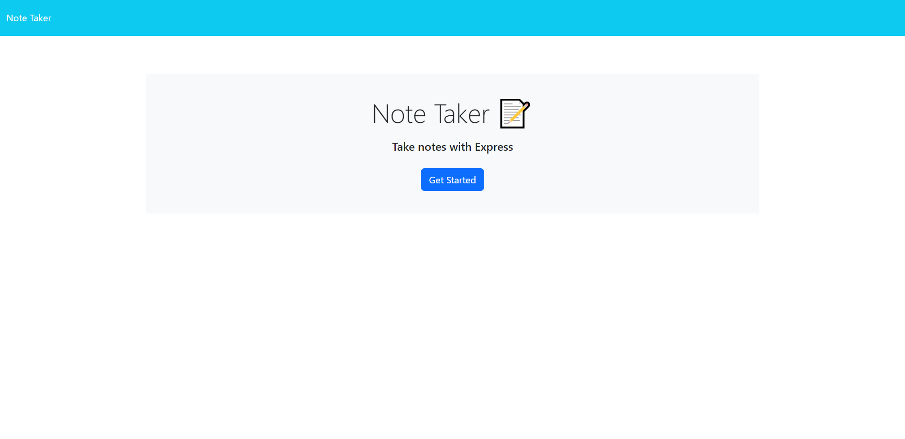
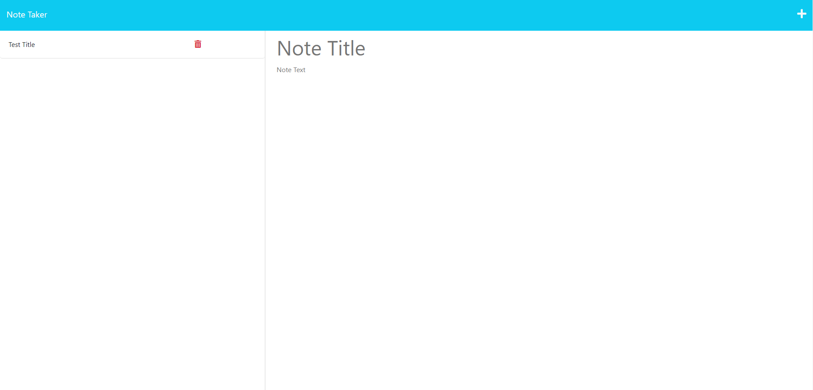

# Note Taker

## Description

Note Taker is an application that allows users to write and save notes. It uses an Express.js back end to store and retrieve note data from a JSON file. Users can organize their thoughts, keep track of tasks, and easily access their saved notes. The code was made from starter code installed from edx bootcamp where I added a server for.

## Table of Contents

- [Installation](#installation)
- [Usage](#usage)
- [API Routes](#api-routes)
- [Technologies Used](#technologies-used)
- [License](#license)
- [Contributing](#contributing)
- [Questions](#questions)

## Installation

To run the Note Taker application locally, follow these steps:

1. Clone the repository to your local machine.
2. Open a terminal and navigate to the project's directory.
3. Install the required dependencies by running the command `npm install`.
4. Start the application by running the command `npm start`.
5. Open your web browser and visit `http://localhost:3001` to access the application.

## Usage

1. Open your web browser and visit the deployed application URL.
2. You will be presented with a landing page that displays a link to the notes page.
3. Click on the "Get Started" button or the "Notes" link to navigate to the notes page.
4. On the notes page, you will see a list of existing notes in the left-hand column and empty fields to enter a new note title and text in the right-hand column.
5. Enter a new note title and text in the provided fields.
6. Click on the save icon in the navigation at the top of the page to save the new note.
7. The new note will be saved and added to the list of existing notes in the left-hand column.
8. To view the content of a saved note, click on the note in the list. The note will appear in the right-hand column.
9. To create a new note, click on the write icon in the navigation at the top of the page. Empty fields will appear to enter a new note title and text.

## API Routes

The Note Taker application has the following API routes:

- `GET /api/notes`: Retrieves all saved notes from the JSON file.
- `POST /api/notes`: Receives a new note to save and adds it to the JSON file.
- `DELETE /api/notes/:id`: Deletes a note with the specified ID from the JSON file.

## Technologies Used

- Express.js
- Node.js
- HTML
- CSS
- JavaScript

## License

This project is licensed under the [MIT License](LICENSE).

## Contributing

Contributions to the Note Taker project are welcome! If you have any improvements or suggestions, please submit a pull request.

## Questions

If you have any questions or issues, please feel free to contact me via email or through my GitHub profile.

- Email: [kajianpulenthirasingam@gmail.com](kajianpulenthirasingam@gmail.com)
- GitHub: [kajianpulenthirasingam](https://github.com/kajianpulenthirasingam)